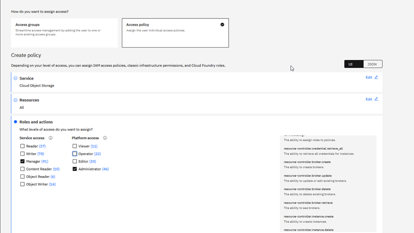

# SAP HANA Backup using Backint and IBM Cloud Object Storage

## Description
This automation solution is designed for the implementation of an SAP HANA Backup solution using Backint and [**IBM Cloud Object Storage**](https://cloud.ibm.com/docs/cloud-object-storage?topic=cloud-object-storage-getting-started-cloud-object-storage). It is based on SAP note "2935898 - Install and Configure SAP HANA Backint Agent for Amazon S3".  
  
The minimum version of SAP HANA Backint Agent for Amazon S3, to be used for IBM COS, is 1.2.17. "SAP HANA Backint Agent for Amazon S3" requires Python3.7, including SSL support. The Python package delivered as part of the SAP HANA 2 installation does not include SSL support, so Python 3.7 with SSL support will be installed in addition in `/usr/local/bin` directory, in case it isn't previously installed. SAP HANA Backint Agent for Amazon S3 will be installed in `/hana/shared/<SID>/backint_agent` directory.

The setup runs just onetime initial full data backup to COS for SYSTEM and TENANT databases. The regular backup policy for the databases must be configured by the customer!

All data backup, log backup and catalog backup files are saved in the same dedicated bucket (with versioning enabled and no enforced storage quota) created in an IBM Cloud Object Storage [instance](https://cloud.ibm.com/objectstorage/) by using an existing [bastion host with secure remote SSH access](https://github.com/IBM-Cloud/sap-bastion-setup) in the same IBM Cloud Gen2 VPC as the SAP HANA system. The storage class for the deployed bucket is a [Smart Tier Storage Class](https://cloud.ibm.com/docs/cloud-object-storage/basics?topic=cloud-object-storage-classes) with [REGIONAL Resiliency](https://cloud.ibm.com/docs/cloud-object-storage/basics?topic=cloud-object-storage-endpoints) and the pricing plan which will be applied is the [STANDARD pricing plan](https://cloud.ibm.com/docs/cloud-object-storage/basics?topic=cloud-object-storage-provision). The COS REGION will be the same with the region where HANA VM is deployed. The SAP HANA system should be previously deployed on top of one of the following Operating Systems: **SUSE Linux Enterprise Server 15 SP 4 for SAP**, **SUSE Linux Enterprise Server 15 SP 3 for SAP**, **Red Hat Enterprise Linux 8.6 for SAP**, **Red Hat Enterprise Linux 8.4 for SAP**.

## Prerequisites
- An SAP HANA system (built on one of the following OS: SUSE Linux Enterprise Server 15 SP 4 for SAP, SUSE Linux Enterprise Server 15 SP 3 for SAP, Red Hat Enterprise Linux 8.6 for SAP or Red Hat Enterprise Linux 8.4 for SAP) should have been previously deployed in an IBM Cloud Gen2 VPC, on a single host (with or without HA).  
  - **Note**: This HANA backup solution was implemented and tested on the following OS images available in IBM Cloud: ibm-sles-15-4-amd64-sap-hana-3, ibm-sles-15-3-amd64-sap-hana-2, ibm-redhat-8-6-amd64-sap-hana-2, ibm-redhat-8-4-amd64-sap-hana-2.
- A [bastion](https://github.com/IBM-Cloud/sap-bastion-setup) server with secure remote SSH access should have been deployed in the same region and zone of the IBM Cloud Gen2 VPC as the SAP HANA system
- A pair of SSH keys to be used to run the automation for the backup configuration should be available. The public SSH key should be manually added on SAP HANA VSI, in `/root/.ssh/authorized_keys` and uploaded in IBM Cloud.
- The IBM Cloud user running the automation for SAP HANA backup should have the [**role of Manager on IBM Cloud Object Storage**](https://cloud.ibm.com/docs/cloud-object-storage?topic=cloud-object-storage-getting-started-cloud-object-storage). To [view/use the credential](https://cloud.ibm.com/docs/account?topic=account-service_credentials&interface=ui), the user must have the IAM level access action `resource-controller.credential.retrieve_all`. This action is given with the **Administrator role**, and overrides any credential level access enabling the user to view the credential.  
**Procedure**: Go to https://cloud.ibm.com/iam/users and select the USER_ID wich will run the automation and then check/grant the required roles. The results should look like bellow:  


- The kit of the backup agent for IBM COS `aws-s3-backint-.*-linuxx86_64.tar.gz` should be manually uploaded on the bastion server. This kit is part of SAP HANA kit file and can be found in `*/DATA_UNITS/HDB_SERVER_LINUX_X86_64/server` path. Either the entire SAP HANA kit or only the kit of the backup agent for IBM COS can be provided, but the minimum backint agent kit version to be used is `aws-s3-backint-1.2.17-linuxx86_64`
- The Python script `create_hdbbackint.py` provided by SAP (SAP note 2935898 - Install and Configure SAP HANA Backint Agent for Amazon S3) to modify the "hdbbackint" script so that it points to the Python 3 libraries should be manually uploaded on the bastion server.
- The HANA DB SYSTEM user should have the same password for SYSTEMDB and all tenant databases

## Contents:

- [1.1 Installation media](#11-installation-media)
- [1.2 VPC and VSI Configuration](#12-vpc-and-vsi-configuration)
- [1.3 Files description and structure](#13-files-description-and-structure)
- [2.1 Executing the deployment of **SAP HANA Backup using Backint and IBM Cloud Object Storage** in CLI](#21-executing-the-deployment-of-sap-hana-backup-using-backint-and-ibm-cloud-object-storage-in-cli)
- [2.2 Executing the deployment of **SAP HANA Backup using Backint and IBM Cloud Object Storage** in GUI (Schematics)](#22-executing-the-deployment-of-sap-hana-backup-using-backint-and-ibm-cloud-object-storage-in-gui-schematics)

- [3.1 Related links](#31-related-links)

## 1.1 Installation media
The SAP kit files required:
- **aws-s3-backint-.*-linuxx86_64.tar.gz** - the kit of the backup agent for IBM COS, which should be manually uploaded on the bastion server. It is part of SAP HANA kit file and can be found in **\*/DATA_UNITS/HDB_SERVER_LINUX_X86_64/server** path. The entire SAP HANA kit can be provided instead, but in both cases, the the minimum backint agent kit version to be used is **aws-s3-backint-1.2.17-linuxx86_64**
- **create_hdbbackint.py**, the Python script provided by SAP (SAP note 2935898 - Install and Configure SAP HANA Backint Agent for Amazon S3) which will be used to modify the "hdbbackint" script so that it points to the Python 3 libraries. It should be manually uploaded on the bastion server.

## 1.2 VPC and VSI Configuration
The solution will be applied on existing VSIs with SAP HANA solution already deployed on them, in an existing VPC.
See:
- https://github.com/IBM-Cloud/sap-netweaver-abap-hana
- https://github.com/IBM-Cloud/sap-netweaver-java-hana
- https://github.com/IBM-Cloud/sap-s4hana
- https://github.com/IBM-Cloud/sap-bw4hana
- https://github.com/IBM-Cloud/sap-netweaver-abap-hana
- https://github.com/IBM-Cloud/sap-s4hana-sz-ha

 ## 1.3 Files description and structure

 - `modules` - directory containing the terraform modules.
 - `ansible` - directory containing the Ansible playbooks used to install the necessary packages, make the backup configuration and execute the initial data backup.
 - `main.tf` - contains the configuration of the VSI for the deployment of the current SAP solution.
 - `data.tf` - it contains tf data from cloud resources
 - `output.tf` - contains the code for the information to be displayed after the SAP HANA Backup solution is deployed.  (BUCKET_NAME, COS_INSTANCE_NAME,  Private IP, Hostname, HANA_SID, HA_CLUSTER, REGION, VPC).
 - `integration*.tf & generate*.tf` files - contain the integration code that makes the SAP variables from Terraform available to Ansible.
 - `provider.tf` - contains the IBM Cloud Provider data in order to run `terraform init` command.
 - `variables.tf` - contains variables for the VPC and VSI.
 - `versions.tf` - contains the minimum required versions for terraform and IBM Cloud provider.
 - `sch.auto.tfvars` - contains programatic variables.

## 2.1 Executing the deployment of **SAP HANA Backup using Backint and IBM Cloud Object Storage** in CLI

The solution is based on Terraform scripts and Ansible playbooks executed in CLI and it is implementing a 'reasonable' set of best practices for SAP VSI host configuration.

**It contains:**
- Terraform scripts for the deployment of a Cloud Object Storage Instance called `<sid>-hana-backup-instance`, a storage bucket (with no enforced storage quota) called `<sid>-hana-backup-bucket VSI` and to create the service credentials called: `<sid>`, in an EXISTING VPC. The REGIONAL Storage Class with Smart Tier pricing option and the STANDARD pricing plan will be used for the storage instance. The Terraform version used for deployment should be >= 1.3.6. Note: The deployment was tested with Terraform 1.3.6
- Ansible scripts used to install the necessary packages, make the backup configuration and execute the initial data backup.
Please note that Ansible is started by Terraform and must be available on the same host.

### IBM Cloud API Key
For the script configuration add your IBM Cloud API Key in terraform planning phase command 'terraform plan --out plan1'.
You can create an API Key [here](https://cloud.ibm.com/iam/apikeys).

### Input parameter file
The solution is configured by asigning the appropriate values to the variables in `input.auto.tfvars` file.
Edit the file `input.auto.tfvars` and asign the appropriate values for: VPC, REGION, SUBNET, SECURITY_GROUP, RESOURCE_GROUP, ID_RSA_FILE_PATH, LIFECYCLE_POLICY, DB_HOSTNAME_1, DB_HOSTNAME_2, HA_CLUSTER as in the following example:

**IBM Cloud input parameters**

```shell
##########################################################
# General VPC variables:
##########################################################

REGION = ""  
# Region for the VSI. The COS will be created in the same region as HANA VSI. Supported regions: https://cloud.ibm.com/docs/containers?topic=containers-regions-and-zones#zones-vpc
# Edit the variable value with your deployment Region.
# Example: REGION = "eu-de"

VPC = ""
# EXISTING VPC, previously created by the user in the same region as HANA VSI. The list of available VPCs: https://cloud.ibm.com/vpc-ext/network/vpcs
# Example: VPC = "ic4sap"

SECURITY_GROUP = ""
# EXISTING Security group, previously created by the user in the same VPC and the same which was set for HANA VSI. The list of available Security Groups: https://cloud.ibm.com/vpc-ext/network/securityGroups
# Example: SECURITY_GROUP = "ic4sap-securitygroup"

RESOURCE_GROUP = "Default"
# EXISTING Resource group, previously created by the user. The list of available Resource Groups: https://cloud.ibm.com/account/resource-groups
# Example: RESOURCE_GROUP = "wes-automation"

SUBNET = ""
# EXISTING Subnet in the same region and zone as HANA VSI, previously created by the user. The list of available Subnets: https://cloud.ibm.com/vpc-ext/network/subnets
# Example: SUBNET = "ic4sap-subnet"

ID_RSA_FILE_PATH = "ansible/id_rsa"
# Input your existing id_rsa private key file path in OpenSSH format with 0600 permissions.
# This private key it is used only during the terraform provisioning and it is recommended to be changed after the SAP deployment.
# It must contain the relative or absoute path from your Bastion.
# Examples: "ansible/sap_hana_backup_cos" , "~/.ssh/sap_hana_backup_cos" , "/root/.ssh/id_rsa".

##########################################################
# COS variables:
##########################################################

LIFECYCLE_POLICY = ""
# The number of retention days for HANA Database backup and Transaction LOG backup
# Example: LIFECYCLE_POLICY = "120"

##########################################################
# HANA VSI variables:
##########################################################

HA_CLUSTER = ""
# Specify if High Availability is configured for HANA Database. Accepted values: yes/no
# For the value "no" it is required that only one variable to be filled in: DB_HOSTNAME_1
# For the value "yes" it is required that both next variables to be filled in: DB_HOSTNAME_1, DB_HOSTNAME_2
# Example: HA_CLUSTER = "yes"

DB_HOSTNAME_1 = ""
# The Hostname of an EXISTING HANA DB VSI. Required. The hostname should be up to 13 characters, as required by SAP
# If High Availability is configured for HANA Database should be the hostname of HANA DB VSI 1.
# Example: DB_HOSTNAME_1 = "hanadb-vsi1"

DB_HOSTNAME_2 = ""
# The Hostname of an EXISTING HANA DB VSI 2. It is required only if High Availability is configured for HANA Database
# The hostname should be up to 13 characters, as required by SAP.
# Example: DB_HOSTNAME_2 = "hanadb-vsi2"
```

Parameter | Description
----------|------------
REGION | The cloud region where HANA VSI was deployed. The COS will be created in the same region as HANA VSI. <br /> The regions and zones for VPC are listed [here](https://cloud.ibm.com/docs/containers?topic=containers-regions-and-zones#zones-vpc). <br /> Review supported locations in IBM Cloud Schematics [here](https://cloud.ibm.com/docs/schematics?topic=schematics-locations).<br /> Sample value: eu-de.
VPC | The name of an EXISTING VPC where HANA VSI was deployed. The list of VPCs is available [here](https://cloud.ibm.com/vpc-ext/network/vpcs)
SECURITY_GROUP | The name of an EXISTING Security group, the same as for HANA VSI. The list of Security Groups is available [here](https://cloud.ibm.com/vpc-ext/network/securityGroups).
RESOURCE_GROUP | The name of an EXISTING Resource Group for VSIs and Volumes resources.  The list of Resource Groups is available [here](https://cloud.ibm.com/account/resource-groups). <br /> Default value: "Default".
SUBNET | The name of an EXISTING Subnet, the same as for HANA VSI. The list of Subnets is available [here](https://cloud.ibm.com/vpc-ext/network/subnets).
ID_RSA_FILE_PATH | The file path for private_ssh_key will be automatically generated by default. If it is changed, it must contain the relative path from git repo folders. <br /> Default value: "ansible/id_rsa".
LIFECYCLE_POLICY | The number of retention days for HANA Database backup and Transaction LOG backup.
HA_CLUSTER | Specifies if High Availability is configured for HANA Database. Accepted values: yes/no. For the value "no" it is required that only one variable to be filled in: DB_HOSTNAME_1. For the value "yes" it is required that both next variables to be filled in: DB_HOSTNAME_1, DB_HOSTNAME_2
DB_HOSTNAME_1 | The Hostname of an EXISTING HANA VSI. Required. If High Availability is configured for HANA Database should be the hostname of HANA DB VSI 1. The hostname should be up to 13 characters as required by SAP. For more information on rules regarding hostnames for SAP systems, check [SAP Note 611361: Hostnames of SAP ABAP Platform servers](https://launchpad.support.sap.com/#/notes/%20611361) 
DB_HOSTNAME_2 | The Hostname of an EXISTING HANA VSI 2. Required only if High Availability is configured for HANA Database. The hostname should be up to 13 characters as required by SAP. For more information on rules regarding hostnames for SAP systems, check [SAP Note 611361: Hostnames of SAP ABAP Platform servers](https://launchpad.support.sap.com/#/notes/%20611361)


**SAP input parameters**
The solution is configured by asigning the appropriate values to the variables in `input.auto.tfvars` file.
Edit the file `input.auto.tfvars` by replacing with the appropriate values for: HANA_SID, HANA_SYSNO, HANA_TENANTS, HANA_KIT_FOR_BACKINT_COS, BACKINT_COS_KIT, CREATE_HDBBACKINT_SCRIPT:
Asign the appropriate values for the SAP HANA system variables, that will be passed to the Ansible automation, as in the following example:

```shell
##########################################################
# SAP HANA backup configuration
##########################################################

HANA_SID = "HDB"
# EXISTING SAP HANA system ID. Should follow the SAP rules for SID naming.
# Obs. This will be used  also as identification number across different HA name resources. Duplicates are not allowed.
# Example: HANA_SID = "HDB"

HANA_SYSNO = "00"
# EXISTING SAP HANA instance number. Should follow the SAP rules for instance number naming.
# Example: HANA_SYSNO = "00"

HANA_TENANTS = ["HDB"]
# A list of EXISTING SAP HANA tenant databases
# Examples: HANA_TENANTS = ["HDB"] or HANA_TENANTS = ["Ten_HDB1", "Ten_HDB2", ..., "Ten_HDBn"]

##########################################################
# Kit Paths
##########################################################

BACKINT_COS_KIT = ""
# The full path to the backup agent for IBM COS kit. Mandatory only if HANA_KIT_FOR_BACKINT_COS is not provided. 
# Make sure the version of the backint agent kit is at least aws-s3-backint-1.2.17-linuxx86_64
# Example: BACKINT_COS_KIT = "/storage/hdb_backup_kit_files/aws-s3-backint/aws-s3-backint-1.2.18-linuxx86_64.tar.gz"

HANA_KIT_FOR_BACKINT_COS = ""
# The full path to SAP HANA kit file to be used by the automation to extract backint agent kit for IBM COS aws-s3-backint-....-linuxx86_64.tar.gz. 
# Mandatory only if BACKINT_COS_KIT is not provided. 
# Make sure the version of the contained backint agent kit is at least aws-s3-backint-1.2.17-linuxx86_64
# Example: HANA_KIT_FOR_BACKINT_COS = "/storage/HANADB/51056441.ZIP"

CREATE_HDBBACKINT_SCRIPT = "/storage/hdb_backup_kit_files/python_script/create_hdbbackint.py"
# The full path to the Python script provided by SAP (SAP note 2935898 - Install and Configure SAP HANA Backint Agent for Amazon S3) 
# to modify the "hdbbackint" script so that it points to the Python 3 libraries
# Example: CREATE_HDBBACKINT_SCRIPT = "/storage/hdb_backup_kit_files/python_script/create_hdbbackint.py"
```

**SAP input parameters:**

Parameter | Description | Requirements |
----------|-------------|-------------
HANA_SID | EXISTING SAP HANA system ID. The SAP system ID identifies the SAP HANA system. <br /> Default value: HDB | <ul><li>Consists of exactly three alphanumeric characters</li><li>Has a letter for the first character</li><li>Does not include any of the reserved IDs listed in SAP Note 1979280</li></ul>|
HANA_SYSNO | EXISTING SAP HANA instance number. Specifies the instance number of the SAP HANA system. <br />Default value: 00 | <ul><li>Two-digit number from 00 to 97</li><li>Must be unique on a host</li></ul>
HANA_TENANTS | A list of EXISTENT SAP HANA tenant databases. <br /> Default value: ["HDB"]. | Mandatory and cannot be empty.
BACKINT_COS_KIT | The full path to the backup agent for IBM COS kit. | Mandatory only if HANA_KIT_FOR_BACKINT_COS is not provided. Make sure the version of the backint agent kit is at least aws-s3-backint-1.2.17-linuxx86_64
HANA_KIT_FOR_BACKINT_COS | The full path to SAP HANA kit file to be used by the automation to extract backint agent kit for IBM COS aws-s3-backint-....-linuxx86_64.tar.gz. | Mandatory only if BACKINT_COS_KIT is not provided. Make sure the version of the contained backint agent kit is at least aws-s3-backint-1.2.17-linuxx86_64
CREATE_HDBBACKINT_SCRIPT | The full path to the Python script provided by SAP (SAP note 2935898 - Install and Configure SAP HANA Backint Agent for Amazon S3) to modify the "hdbbackint" script so that it points to the Python 3 libraries. <br /> Default value: /storage/hdb_backup_kit_files/<br />python_script/create_hdbbackint.py | Mandatory

**SAP Passwords** 
The passwords for the SAP HANA system will be asked interactively during terraform plan step and will not be available after the deployment. (Sensitive* values).

Parameter | Description | Requirements
----------|-------------|-------------
HANA_MAIN_PASSWORD | HANA system master password. The HANA DB SYSTEM user should have the same password for SYSTEMDB and all tenant databases | <ul><li>It must be 8 to 14 characters long</li><li>It must contain at least one digit (0-9)</li><li>It must not contain \ (backslash) and " (double quote)</li><li>Master Password must contain at least one upper-case character</li></ul>

**Obs***: <br />
- Sensitive - The variable value is not displayed in your tf files details after terrafrorm plan&apply commands.<br />
- The following variables should be the same like the bastion ones: REGION, ZONE, VPC, SUBNET, SECURITY_GROUP.

### Steps to follow:

For initializing terraform:

```shell
terraform init
```

For planning phase:

```shell
terraform plan --out plan1
# you will be asked for the following sensitive variables: 'IBM_CLOUD_API_KEY' and 'hana_main_password'.
```

For apply phase:

```shell
terraform apply "plan1"
```

For destroy there are two steps to follow:

Step 1 - change/adapt Hana backup configuration to not use backint/backup to IBM COS
1) Check and change/delete any Hana database backup job ( for SYSTEM and tenant DBs) already scheduled, using the same tool used for scheduling (OS crontab, SAP DB13, SAP HANA Cockpit, Hana Studio...), to not use the backint/backup to IBM COS anymore.
2) Make sure that the Hana "LOG Backup Settings" is changed  from backint/backup to COS to any other "Destination type" (file/disk, other backup tool). You may use SAP HANA Cockpit, Hana Studio...
   Double check in the "Hana backup log" file and the new backup location to see if Hana logs are automatically backed up as needed..
3) Make sure Hana "Backup Catalog" destination is changed  from backint/backup to COS to any other "Destination type" (file/disk, other backup tool). You may use SAP Hana Cockpit, Hana Studio...
4) Make sure that you don't need the previous backups of Hana data and logs saved to COS; COS and all Hana data backups and logs backups will be deleted; Make sure you saved them before in another location if you still need them.
5) Run a full DATA backup test for SYSTEM and Tenant DBs using the new backup location (file/disk, other backup tool), different from IBM COS. Make sure all backups complete succesfuly in the new location
6) Check and reschedule full data backups for SYSTEM and tenant DBs using the new "Destination type" (file/disk, other backup tool)

Step 2 - Release the IBM Bucket and delete all the backups

Case A: The IBM bucket contains only SAP HANA backup files
1) Make sure that `cloud-object-storage` plugin is installed on your bastion server, by running the command:

    ```shell
    ibmcloud cos --help
    ```
    If missing, install the plugin by running the following command:

    ```shell
    ibmcloud plugin install cloud-object-storage
    ```

2) Use Teraform destroy command to delete the used IBM bucket (COS) and its content/backups. 

    ```shell
    terraform destroy
    # you will be asked for the following sensitive variables as a destroy confirmation phase:
    'IBM_CLOUD_API_KEY'  and  'HANA_MAIN_PASSWORD'.
    ```

Case B: The IBM bucket contains other files besides SAP HANA backup files 

1) There is one way to empty a bucket via the GUI at the IBM Cloud console: using an expiration rule on the bucket itself. For more information, please see the documentation on deleting stale data with expiration rules.
After logging in to Object Storage, choose your storage instance. Then, select your bucket from the list of your buckets. To set the rule to delete the items, select Configuration from the navigation menu and click Add rule under the Expiration rule section. Set the number of days to '1' to delete all the items after one day.
https://cloud.ibm.com/docs/cloud-object-storage?topic=cloud-object-storage-deleting-multiple-objects-patterns

2) Use Teraform destroy command to delete the used IBM bucket (COS). 

    ```shell
    terraform destroy
    # you will be asked for the following sensitive variables as a destroy confirmation phase:
    'IBM_CLOUD_API_KEY'  and  'HANA_MAIN_PASSWORD'.
    ```

**Notes:**
- The used files/directories for "Python 3.7 with ssl support" and  "S3 backint"  will still be present at OS level on Hana VSI but Hana will no longer use them.


## 2.2 Executing the deployment of **SAP HANA Backup using Backint and IBM Cloud Object Storage** in GUI (Schematics)

The solution is based on Terraform remote-exec and Ansible playbooks executed by Schematics and it is implementing a 'reasonable' set of best practices for SAP VSI host configuration.

**It contains:**
- Terraform scripts for the deployment of a Cloud Object Storage Instance called `<sid>-hana-backup-instance`, a storage bucket (with no enforced storage quota) called `<sid>-hana-backup-bucket VSI` and to create the service credentials called: `<sid>`, in an EXISTING VPC. The REGIONAL Storage Class with Smart Tier pricing option and the STANDARD pricing plan will be used for the storage instance. The Terraform version used for deployment should be >= 1.3.6. Note: The deployment was tested with Terraform 1.3.6
- Bash scripts are used to check the prerequisites for the SAP HANA Backup solution to be integrated into a single step in the IBM Schematics GUI. 
- Ansible scripts used to install the necessary packages, make the backup configuration and execute the initial data backup.
Please note that Ansible is started by Terraform and must be available on the same host.

### IBM Cloud API Key
The IBM Cloud API Key should be provided as input value of type sensitive for "IBM_CLOUD_API_KEY" variable, in `IBM Schematics -> Workspaces -> <Workspace name> -> Settings` menu.
The IBM Cloud API Key can be created [here](https://cloud.ibm.com/iam/apikeys).

### Input parameters
The following parameters can be set in the Schematics workspace: VPC, REGION, SUBNET, SECURITY_GROUP, RESOURCE_GROUP, ID_RSA_FILE_PATH, LIFECYCLE_POLICY, DB_HOSTNAME_1, DB_HOSTNAME_2, HA_CLUSTER and your SAP system configuration variables, as below:

**IBM Cloud input parameters:**

Parameter | Description
----------|------------
IBM_CLOUD_API_KEY | IBM Cloud API key (Sensitive* value).
PRIVATE_SSH_KEY | Input your id_rsa private key content in OpenSSH format (Sensitive* value). This private key should be used only during the terraform provisioning and it is recommended to be changed after the SAP deployment.
ID_RSA_FILE_PATH | The file path for private_ssh_key will be automatically generated by default. If it is changed, it must contain the relative path from git repo folders. <br /> Default value: "ansible/id_rsa".
BASTION_FLOATING_IP | The FLOATING IP of an EXISTING Bastion Server, in the same REGION as HANA VSI
RESOURCE_GROUP | The name of an EXISTING Resource Group for VSIs and Volumes resources.  The list of Resource Groups is available [here](https://cloud.ibm.com/account/resource-groups). <br /> Default value: "Default".
REGION | The cloud region where HANA VSI was deployed. The COS will be created in the same region as HANA VSI. <br /> The regions and zones for VPC are listed [here](https://cloud.ibm.com/docs/containers?topic=containers-regions-and-zones#zones-vpc). <br /> Review supported locations in IBM Cloud Schematics [here](https://cloud.ibm.com/docs/schematics?topic=schematics-locations).<br /> Sample value: eu-de.
VPC | The name of an EXISTING VPC where HANA VSI was deployed. The list of VPCs is available [here](https://cloud.ibm.com/vpc-ext/network/vpcs)
SUBNET | The name of an EXISTING Subnet, the same as for HANA VSI. The list of Subnets is available [here](https://cloud.ibm.com/vpc-ext/network/subnets).
SECURITY_GROUP | The name of an EXISTING Security group, the same as for HANA VSI. The list of Security Groups is available [here](https://cloud.ibm.com/vpc-ext/network/securityGroups).
LIFECYCLE_POLICY | The number of retention days for HANA Database backup and Transaction LOG backup.
HA_CLUSTER | Specifies if High Availability is configured for HANA Database. Accepted values: yes/no. For the value "no" it is required that only one variable to be filled in: DB_HOSTNAME_1. For the value "yes" it is required that both next variables to be filled in: DB_HOSTNAME_1, DB_HOSTNAME_2
DB_HOSTNAME_1 | The Hostname of an EXISTING HANA VSI. Required. If High Availability is configured for HANA Database should be the hostname of HANA DB VSI 1. The hostname should be up to 13 characters as required by SAP. For more information on rules regarding hostnames for SAP systems, check [SAP Note 611361: Hostnames of SAP ABAP Platform servers](https://launchpad.support.sap.com/#/notes/%20611361) 
DB_HOSTNAME_2 | The Hostname of an EXISTING HANA VSI 2. Required only if High Availability is configured for HANA Database. The hostname should be up to 13 characters as required by SAP. For more information on rules regarding hostnames for SAP systems, check [SAP Note 611361: Hostnames of SAP ABAP Platform servers](https://launchpad.support.sap.com/#/notes/%20611361)

**SAP input parameters:**

Parameter | Description | Requirements
----------|-------------|-------------
HANA_SID | EXISTING SAP HANA system ID. The SAP system ID identifies the SAP HANA system. <br /> Default value: HDB | <ul><li>Consists of exactly three alphanumeric characters</li><li>Has a letter for the first character</li><li>Does not include any of the reserved IDs listed in SAP Note 1979280</li></ul>|
HANA_SYSNO | EXISTING SAP HANA instance number. Specifies the instance number of the SAP HANA system. <br />Default value: 00 | <ul><li>Two-digit number from 00 to 97</li><li>Must be unique on a host</li></ul>
HANA_TENANTS | A list of EXISTENT SAP HANA tenant databases. <br /> Default value: ["HDB"]. | Mandatory and cannot be empty.
BACKINT_COS_KIT | The full path to the backup agent for IBM COS kit. | Mandatory only if HANA_KIT_FOR_BACKINT_COS is not provided. Make sure the version of the backint agent kit is at least aws-s3-backint-1.2.17-linuxx86_64
HANA_KIT_FOR_BACKINT_COS | The full path to SAP HANA kit file to be used by the automation to extract backint agent kit for IBM COS aws-s3-backint-....-linuxx86_64.tar.gz. | Mandatory only if BACKINT_COS_KIT is not provided. Make sure the version of the contained backint agent kit is at least aws-s3-backint-1.2.17-linuxx86_64
CREATE_HDBBACKINT_SCRIPT | The full path to the Python script provided by SAP (SAP note 2935898 - Install and Configure SAP HANA Backint Agent for Amazon S3) to modify the "hdbbackint" script so that it points to the Python 3 libraries. <br /> Default value: /storage/hdb_backup_kit_files/<br />python_script/create_hdbbackint.py | Mandatory

**SAP Passwords** 
The password for the SAP HANA system will be asked interactively during terraform plan step and will not be available after the deployment. (Sensitive* values).

Parameter | Description | Requirements
----------|-------------|-------------
HANA_MAIN_PASSWORD | HANA system master password. The HANA DB SYSTEM user should have the same password for SYSTEMDB and all tenant databases | <ul><li>It must be 8 to 14 characters long</li><li>It must contain at least one digit (0-9)</li><li>It must not contain \ (backslash) and " (double quote)</li><li>Master Password must contain at least one upper-case character</li></ul>

**Obs***: <br />
- Sensitive - The variable value is not displayed in your tf files details after terrafrorm plan&apply commands.<br />
- The following variables should be the same like the bastion ones: REGION, ZONE, VPC, SUBNET, SECURITY_GROUP.

### Steps to follow:

1.  Make sure you have the [required IBM Cloud IAM permissions](https://cloud.ibm.com/docs/vpc?topic=vpc-managing-user-permissions-for-vpc-resources) to create and work with VPC infrastructure and you are [assigned the correct permissions](https://cloud.ibm.com/docs/schematics?topic=schematics-access) to create the workspace in Schematics and deploy resources.
2.  [Generate an SSH key](https://cloud.ibm.com/docs/vpc?topic=vpc-ssh-keys). The SSH key is required to access the provisioned VPC virtual server instances via the bastion host. After you have created your SSH key, make sure to [upload this SSH key to your IBM Cloud account](https://cloud.ibm.com/docs/vpc-on-classic-vsi?topic=vpc-on-classic-vsi-managing-ssh-keys#managing-ssh-keys-with-ibm-cloud-console) in the VPC region and resource group where you want to deploy the HANA backup solution
3.  Create the Schematics workspace:
    1.  From the IBM Cloud menu select [Schematics](https://cloud.ibm.com/schematics/overview).
       - Click Create a workspace.
       - Enter a name for your workspace.
       - Click Create to create your workspace.
    2.  On the workspace **Settings** page, enter the URL of this solution in the Schematics examples Github repository.
     - Select the latest Terraform version.
     - Click **Save template information**.
     - In the **Input variables** section, review the default input variables and provide alternatives if desired.
    - Click **Save changes**.

4.  From the workspace **Settings** page, click **Generate plan** 
5.  Click **View log** to review the log files of your Terraform
    execution plan.
6.  Apply your Terraform template by clicking **Apply plan**.
7.  Review the log file to ensure that no errors occurred during the
    provisioning, modification, or deletion process.

The output of the Schematics Apply Plan will list the BUCKET_NAME, COS_INSTANCE_NAME, HANA-DB-PRIVATE-IP-VS1, HANA-DB_HOSTNAME_1, HANA-DB_HOSTNAME_2, HANA_SID, HA_CLUSTER, REGION, and VPC.

### 3.1 Related links:

- [How to create a BASTION/STORAGE VSI for SAP in IBM Schematics](https://github.com/IBM-Cloud/sap-bastion-setup)
- [Securely Access Remote Instances with a Bastion Host](https://www.ibm.com/cloud/blog/tutorial-securely-access-remote-instances-with-a-bastion-host)
- [VPNs for VPC overview: Site-to-site gateways and Client-to-site servers.](https://cloud.ibm.com/docs/vpc?topic=vpc-vpn-overview)
- [IBM Cloud Schematics](https://www.ibm.com/cloud/schematics)
